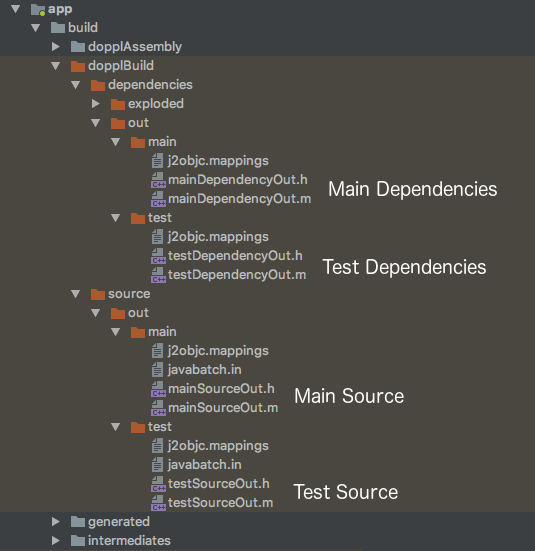

# J2objc Gradle Plugin

This is a gradle plugin for the J2objc framework. It manages dependencies, your Java source, and transforms that code to Objective-C.
The plugin also provides Cocoapod specs to facilitate importing source into Xcode.

## Brief History

This plugin is a fork of an earlier J2objc Gradle plugin, but has morphed very significantly in scope and design. It may
be merged into that project in the future.

This plugin was part of the "Doppl" framework, which also included a fork of J2objc itself, but those changes have been 
merged to J2objc, so "Doppl" just refers to the extended Android architecture libraries (see [https://doppl.co](https://doppl.co)).

More [history](#history) detail at the end of this doc.

## Getting Started

The easiest way to try out the plugin is to check out the quickstart guide.

[Quick Start](http://doppl.co/docs/quicktutorial.html)

## Tasks

The plugin defines a number of tasks, but the main tasks you will probably use are the following.

* 'j2objcBuild' This will stage and translate dependencies and source for both main and test paths,
and create the cocoapods podspec files to be used in Xcode. There's a *very* good chance this is the only task you'll ever need.

* 'j2objcArchive' Will create the zip file archive for published dependencies.

* 'j2objcPreBuild' If you need to run something before EVERYTHING in j2objc runs, make this task depend on your task.

* 'j2objcContextBuild' Similar to above, but run after all the project's java operations run, 
including annotation processing.

## Dependencies

You can specify dependencies using the plugin's dependency format or reference standard sources jars.  

### Dop Archive

The dop archive is a regular zip archive with the '.dop' extension. The purpose of the special archive type is somewhat historical, 
but there are still a few important reasons to have a custom archive type. 

1. You can include C/C++/ObjC/Swift code directly in your dependency
2. There is no confusion that this Java source is intended for J2objc. Most open source Java project deploy a sources jar, but they would be unlikely to transpile out of the box.
3. Sources jars are generally co-published with regular jars, and maven doesn't do a good job of transitive dependencies with classifiers.

Inside the archive, the Java sources are in a 'java' folder. Native code is in the 'src' folder, although most dependencies won't have native code included.

Here's an exmaple dependency declaration for rxjava2 and rxandroid2

```gradle
implementation "io.reactivex.rxjava2:rxjava:2.1.5"
j2objc "co.doppl.io.reactivex.rxjava2:rxjava:2.1.5.3"
implementation "io.reactivex.rxjava2:rxandroid:2.0.1"
j2objc "co.doppl.io.reactivex.rxjava2:rxandroid:2.0.1.7"

```

### Sources Jar

You can also reference source jars for some projects. Java projects often publish source jars under the "sources" classifier.

```gradle
implementation "io.reactivex.rxjava2:rxjava:2.1.5"
doppl "io.reactivex.rxjava2:rxjava:2.1.5:sources"
implementation "io.reactivex.rxjava2:rxandroid:2.0.1"
doppl "io.reactivex.rxjava2:rxandroid:2.0.1:sources"

```

**Keep in mind** most Java source projects won't work well right out of the box, and the sources classifier won't 
resolve transitive dependencies. It's generally better to create your own dependency projects and run the unit tests
for them. For example, the rxjava2 dependency above will probably transpile, but you'll need to add all dependencies, and
there were small tweaks to the j2objc-specific version. The rxandroid dependency above will fail.

### Configurations

There are 3 configurations for J2objc dependencies

* j2objc: Main source compile configuration. Will be included in downstream dependencies.
* j2objcOnly: Main source compile configuration. Will *not* be included in downstream dependencies. Similar to 'compileOnly'.
* testJ2objc: Test source compile configuration.

They're roughly equivalent to compile, provided, and testCompile. In newer builds, implementation, compileOnly, and testImplementation.

```gradle
implementation "com.google.code.gson:gson:2.6.2"
j2objc "co.doppl.com.google.code.gson:gson:2.6.2.7"
compileOnly project(":paging:common")
j2objcOnly project(":paging:common")
testImplementation "junit:junit:4.12"
testJ2objc "co.doppl.junit:junit:4.12.0"

```

### Project Dependencies

Project dependencies generally work, but there have been some issues in certain configurations. Also, the maven publishing plugin cannot deploy more than one artifact,
which can cause issues with the project dependencies if you're building a library. This is an open issue and will hopefully be resolved.

### What about annotation processing?

Annotation processing usually generates additional Java source and puts that in the 'generated' subfolder of build. Assuming 
things are configured correctly, the J2objc plugin should find that and send it through J2objc just like your source. So,
usually, you don't need to do anything. 

## Plugin Design

The plugin collects your dependencies, then attempts to transpile your code and dependencies to Objective C output. The plugin will also generate cocoapod
definition files which make integrating the transpiled code simpler. Using Cocoapods is optional but suggested.

In the past, each input Java file would generate both an 'h' and an 'm' file on output. For a number of reasons, the way the current plugin runs j2objc is different. 
For all main Java input files, there is one large 'h' and 'm' output. Same for all dependencies, all test Java files, and all test dependencies.

So, if you have both main and test Java and some set of dependencies for each, that means 4 sets of 'h' and 'm' files total.



Using one large file for output is simpler for importing into Xcode and speeds up build times on the Xcode side, but means
the file is completely rebuilt any time you change a Java file.

## J2objc "standard" libraries

J2objc ships with several available libraries you can use, including Junit, Mockito, and Guava, packaged as either 
static archives or Xcode frameworks. The Gradle plugin only references the JRE library directly. Junit and Mockito 
have J2objc-specific versions published as their own dependencies. Guava itself is J2objc aware, and doesn't have
dependencies, so you can reference it as a sources jar.

```groovy
testImplementation "junit:junit:4.12"
testJ2objc "co.doppl.junit:junit:4.12.0"
testCompile "org.mockito:mockito-core:1.9.5"
testJ2objc "co.doppl.org.mockito:mockito-core:1.9.5.1"
compile 'com.google.guava:guava:19.0'
j2objc 'com.google.guava:guava:19.0:sources'

```

The javax inject and jsr305 libraries are automatically added by the plugin during config. They're small and used
extensively in our projects. If this winds up being problematic for users, we can make these dependencies explicit.

Because the gradle plugin only uses the JRE, we distribute a smaller J2objc runtime package for auto-config builds (about 350m vs 1g+).

## Config

Options that can be set in j2objcConfig. Except where noted, the example value in the default, and
can be left empty in your config (if you're happy with the default).

```groovy
j2objcConfig {

    //Adds metadata to generated code that will let you debug in Java instead of Objective-C
    javaDebug false
    
    //Adds metadata to generated code that will let you debug in Java instead of Objective-C
    //This applies to dependency code
    dependenciesJavaDebug false
    
    //Prefix applied to classes with matching package. Shortens Objective-C name.
    //All packages must be explicitly added. No wildcards.
    // *There are no default prefixes defined*
    translatedPathPrefix 'com.example.foo', 'FOO' 
    translatedPathPrefix 'com.example.bar', 'BAR'
    
    //By default, all Java code in your module is translated. However, in some cases this won't make
    //sense. Especially if in an Android module. Use a pattern to match which files you want 
    //to translate
    translatePattern {
        include '**/shared/**'
        include '**/BuildConfig.*'
    }
    
    //Applies to 'dopplTest' task, which creates a list of tests to run based on path
    //By default, the pattern is 'include "**/*Test.java"', but can be customized.
    testIdentifier {
        include "**/*Test.java"
        exclude "**/OneTest.java" //A file matches that we don't want
        exclude "**/Abstract**.java" //If we prefix your abstract classes with 'Abstract', exclude them
    }
    
    //The cocoapod framework definitions have some specific config options available. All have 
    //default values, so this is generally not necessary, but available
    mainFramework{
    
        //Point to Xcode project with the Podfile defined. This will automatically call
        //'pod install' when needed based on added/removed classes and dependencies.
        managePod "../ios"
    
        /************ XCODE STUFF ************/
        /************ These are all build settings with sane deftauls ************/
        
        //Xcode linker flags. If you're new to Xcode, best to skip these.
        //Adds -ObjC flag to linker
        flagObjc = true
        
        //Library linker flags
        libZ = true
        libSqlite3 = true
        libIconv = true
        libJavax_inject = true
        libJre_emul = true
        
        //More library linker flags
        addLibraries "somelib", "another"
        
        //Links to UIKit framework. Often required for J2objc builds
        frameworkUIKit = true
        
        //More frameworks
        addFrameworks "SomeOtherFramework"
    
        //Writes local path to podspec. If false sets $(J2OBJC_LOCAL_PATH), which you need to set
        //in Xcode env variables
        writeActualJ2objcPath = true
    
        /************ OTHER SETTINGS ************/
    
        //The following values are required by Cocoapods to define a podspec. Assuming you won't be 
        //publishing your generated podspec, changing these values won't accomplish anything, but
        //they are configurable
        homepage = "https://github.com/j2objcgradle"
        license = "{ :type => 'Apache 2.0' }"
        authors = "{ 'Filler Person' => 'filler@example.com' }"
        source = "{ :git => 'https://github.com/j2objcgradle/gradle.git'}"
    }
    
    testFramework{
        //Same as above, for the test cocoapod
    }
    
    //Android only. By default the plugin uses the debug variant to look for generated sources.
    //If you want a different or custom variant, specify here.
    targetVariant = "debug"
    
    //Skips some test tasks to speed up translation. This is false by default, and in general should
    //only be used during development.
    skipTests = false
    
    //The plugin runs upstream Java build tasks to make sure any generated code is available. This 
    //can add significant time to the edit/test cycle during development. You can disable this 
    //temporarily to speed the process up, but leaving this on will be obviously problematic. 
    skipDependsTasks = false
    
    //The plugin should be able to automatically find generated source directories, but you can specify
    //a path if this automatic discovery isn't working
    generatedSourceDirs "build/generated/source/apt/debug", ...
    
    //Same for test code
    generatedTestSourceDirs "build/generated/source/apt/test/debug", ...
    
    //Arguments sent to J2objc translator. See J2objc docs for info.
    translateArgs "-foo", "-bar"
    
    //Arguments sent to J2objc cycle finder. See J2objc docs for info.
    cycleFinderArgs "-foo", "-bar"
    
    //If you want to disable our analytics code. We capture info from the plugin. All
    //data is anonymous. We don't know anyting about you or your app, just what settings
    //and versions you're using. We may in the future add performance values and failures
    //to captured data.
    disableAnalytics = false
}
```

## License

This library is distributed under the Apache 2.0 license found in the [LICENSE](./LICENSE) file.
J2ObjC and libraries distributed with J2ObjC are under their own licenses.

## History

The Doppl plugin started as a fork of the earlier [j2objc-gradle](https://github.com/j2objc-contrib/j2objc-gradle) plugin. Although ideologically similar, 
the two plugins differ significantly at this point in scope.

Many thanks to the [developers](https://github.com/doppllib/doppl-gradle/blob/master/NOTICE#L19) of j2objc-gradle.

### Main Contributors

* Advay Mengle @advayDev1 <source@madvay.com>
* Bruno Bowden @brunobowden <github@brunobowden.com>
* Michael Gorski @confile <mail@michaelgorski.de>

### Thanks

* Peter Niederweiser @pniederw <peter@pniederw.com>
* Sterling Greene @big-guy <sterling.greene@gradleware.com>

